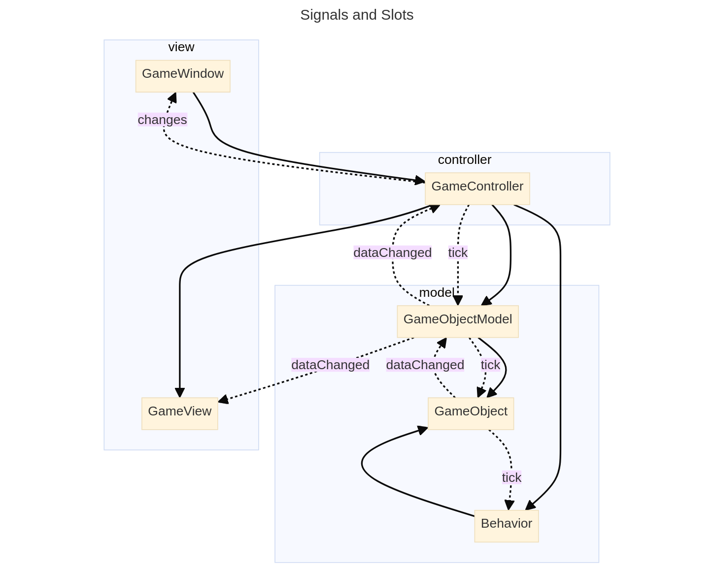

# Architecture

The main challenge on making this game was ensuring the architecture was MVC, 
even though finding a consistent definition of MVC was not easy. The first formalization of 
MVC in a paper from two members of the Smalltalk team. The core ideas and true 
purpose of MVC is in there. "Models are those components of the system 
application that actually do the work (simulation of the application domain). 
They are kept separate from views, which display aspects of the models. 
Controllers are used to send messages to the model, and provide the 
interface between the model with its associated views and the interactive user 
interface devices (e.g., keyboard, mouse)." Each view will be related to one 
controller, but a model may have many view controller pairs. This is similar to
the approach used by modern MVC frameworks such as Spark or Django with a few 
caveats but all with the same idea. To separate the view from the model as 
much as possible to maintain true separation of concerns. Django class 
views for example work with any model, by using a separate Form class that interfaces
between both. It makes it so that regardless of the underlying definition
of a model, it will be possible to simply drop into a pre made view and use it 
(in most cases).

This level of decoupling is not trivial to do on a game. Web-apps are inherently
data driven, so all changes in the view can be propagated using HTTP to the model
and back. It is not the same case for games, which deal with more complex interactions
and are less asyncronous in nature. 

The definition of a model is not consistent either, In Django, Laravel, and 
Spring the "models" map instance attributes to columns in a DB (this is 
necessary for a DAL and it is better defined as an active 
[record](https://martinfowler.com/eaaCatalog/activerecord.html)/[repository](https://martinfowler.com/eaaCatalog/repository.html). 
When instantiating a "model" in that case, you are really accessing the 
underlying table through a class. The class can then query the table and 
return the data using the same class. It makes programming much simpler, 
but leads many people to think that all classes with data in them are models. 
"The behavior required of models is the ability to have dependents and the 
ability to broadcast change messages to their dependents. Models hold onto a 
collection of their dependent objects. The class Model has message protocol to 
add and remove dependents from this collection.". Therefore a class that stores
some data is closer to a Domain Object (https://wiki.c2.com/?DomainObject), 
and a store of those Domain Objects is more accurately defined as a model. This is 
also somewhat similar to the ideas in modern MVC, with changes in nomenclature depending
on the framework.

The responsibility of handling user input is mostly left open. It is very
dependent on the framework and the type of input the user can do.

With this in mind, the following architecture was developed for the game. Keeping
in mind that the parent/child relationship between the GameWindow and the
GameController is necessary for Qt but not part of MVC in any way.

The GameController::dataChanged signal is connected to the GameView::dataChanged slot.
Whenever there is a change in the model, it emits a signal with a QMap< DataRole, QVariant >.
Enough information is encoded here for the view to make any changes necessary to the
visualization of the game. It does this without ever knowing that GameObjects or GameObjectModels
exist. This makes it incredibly flexible, especially since the controller is the one handling the 
connections.

## Important Signals/Slots/Actions
The following diagram shows how each class interacts with the others. Solid lines represent direct connections, while dotted lines represent signals/slots.

The flexibility of this lies in how the connections are propagated. The user makes an action either through the keyboard, with the text input, or clicks a button in the GameWindow UI. This will make the GameWindow send the correct action to the GameController. Moving the protagonist/attacking an enemy. The controller always keeps a pointer to the GameObject of the character for performance reasons (it can look for any object in the model but it takes some time). The controller gets the appropriate action, triggers it, and then emits a tick signal. When GameObjects/GameObjectModels are created, their children are set since they are all QObjects, the parent also connects the childs dataChanged and tick signal to its own. If the child is not passed on creation, this has to be done manually. The ticks make all of the behaviors that are time based work for one "cycle". The behavior then can call an arbitrary number of behaviors, and it might or might not change any data in any/all GameObjects. When any data is changed, the GameObject will emit a signal GameObject::dataChanged. This will propagate the signal through the tree until it finally reaches the GameObjectModel. The signal in the active GameObjectModel is connected to the GameView::dataChanged slot, as well as the GameController::dataChanged slot. These two will handle the changes in whatever way is best. 

The importance of the signal propagation is that when a level changes, the only thing the controller has to do is make a new Scene with the GameView::createScene (which clears the scene and destroys all previous pixmaps) and disconnect the 3 slots. When the world is accessed again, it simply has to connect them.